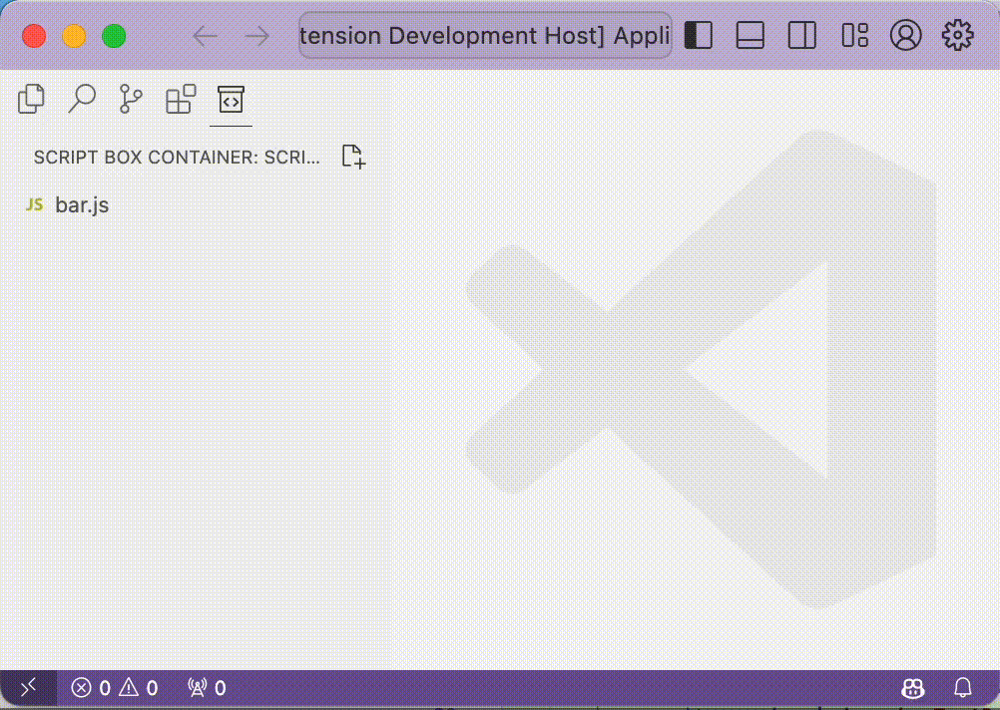

# Script Box README

## Introduction

Script Box is a Visual Studio Code extension that allows you to manage and run scripts directly from your editor. It provides a dedicated view in the activity bar where you can create, delete, rename, and run scripts.

## Features

- Run scripts directly from Visual Studio Code
- Manage scripts with ease
- Dedicated view in the activity bar
- Create, delete, rename, and run scripts

## Demo

## License

This project is licensed under the terms of the MIT license.
